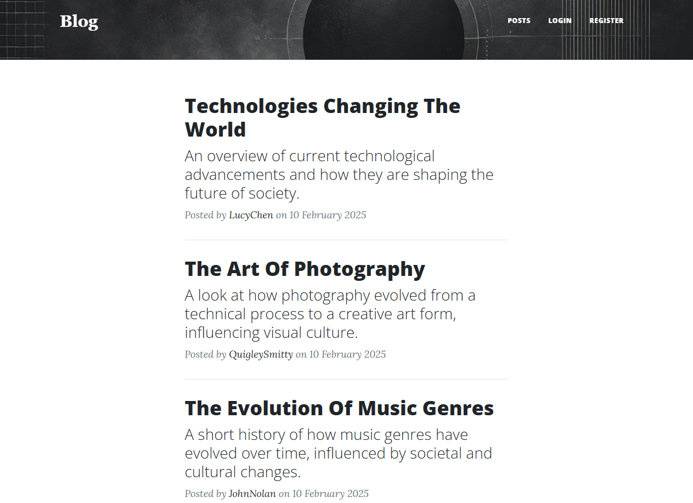
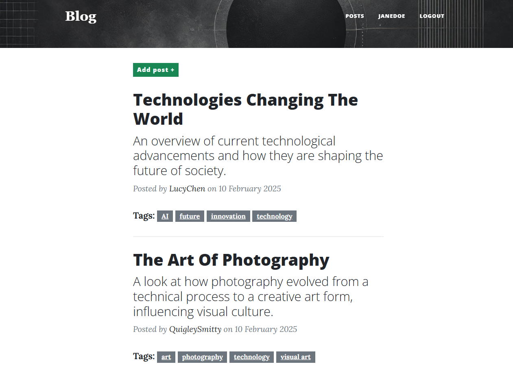
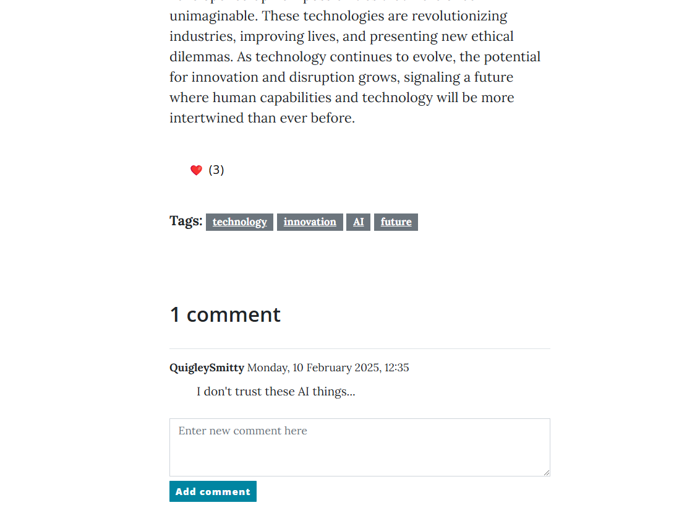
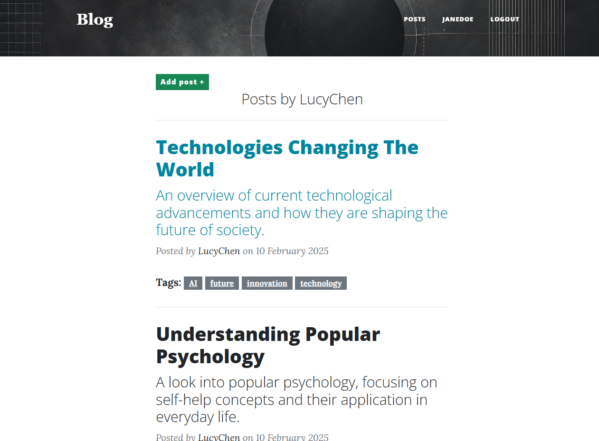

# Blog
This is a basic implementation of a blog website using the Django framework.

https://blog-vycv.onrender.com/

To try out the full functionality, you can register, or log in using the following nicknames:

`JaneDoe:
Mo9jcEGzOl`

`JohnDoe:
n1Xk6n7njo`

## Implemented functionality
- basic authentication and registration
- tagging via `django-taggit`
- CRUD operations
- pagination

# Setup and launch

To deploy the project on your PC follow the instructions [here](SETUP.md).

